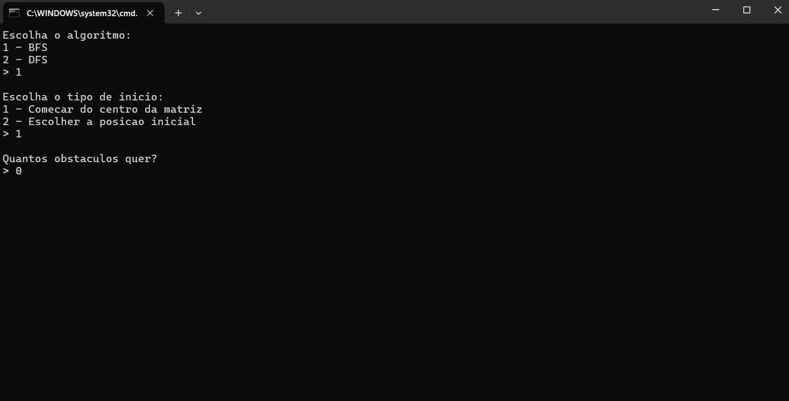
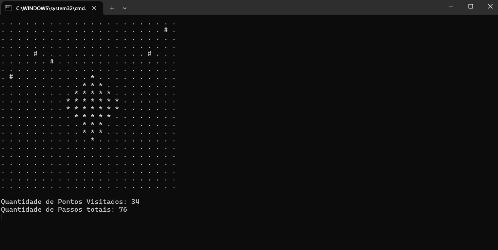
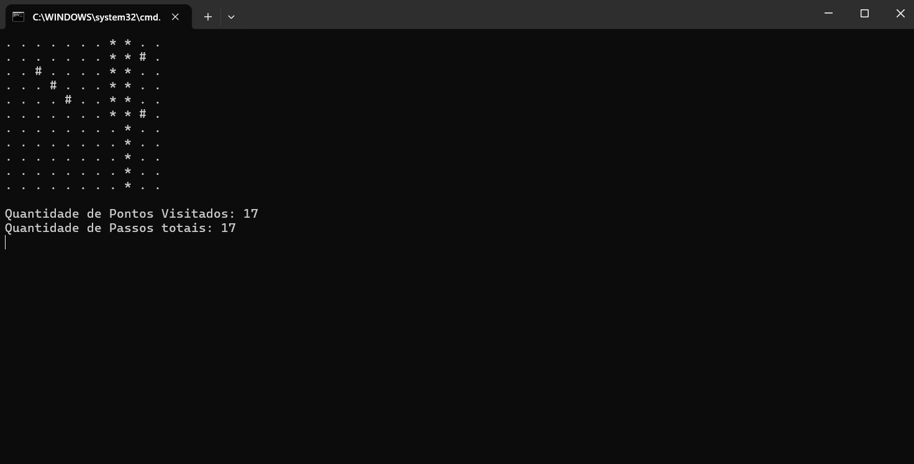

# 🔍 Projeto de Busca em Grafos - DFS e BFS

**Número da Lista:** X
**Conteúdo da Disciplina:** Grafos 1 - BFS, DFS e Flood Fill  

## 👨‍🏫 Alunos

| Matrícula   | Aluno             |
|-------------|-------------------|
| 202045482   | [Genilson Silva](https://github.com/GenilsonJrs)    |
| 222022064   | [Carlos Eduardo](https://github.com/dudupaz)    |

---

## 📋 Sobre

Este trabalho tem como objetivo implementar, de forma visual e interativa, dois algoritmos fundamentais do estudo de grafos: **DFS (Depth-First Search)** e **BFS (Breadth-First Search)**.

A aplicação consiste em uma matriz de tamanho fixo, onde o algoritmo percorre os espaços livres e marca os caminhos visitados com o caractere `*`. O usuário pode escolher:

- Qual algoritmo utilizar (BFS ou DFS)
- Se deseja iniciar a busca do centro da matriz ou de uma coordenada personalizada

Este projeto busca reforçar conceitos teóricos de grafos com uma visualização prática e didática.

---

## 🖼️ Screenshots

<p align="center">Figura 1 - BFS ou DFS</p>

<p align="center">
  
</p>

<p align="center" style="font-size: 14px;">
  Autores: <a href="https://github.com/dudupaz" target="_blank">Carlos Paz</a>, 
  <a href="https://github.com/GenilsonJrs" target="_blank">Genilson Silva</a>
</p>

---

<p align="center">Figura 2 - Obstáculos</p>

<p align="center">
  
</p>

<p align="center" style="font-size: 14px;">
  Autores: <a href="https://github.com/dudupaz" target="_blank">Carlos Paz</a>, 
  <a href="https://github.com/GenilsonJrs" target="_blank">Genilson Silva</a>
</p>

---

<p align="center">Figura 3 - Funcionamento BFS</p>

<p align="center">
  
</p>

<p align="center" style="font-size: 14px;">
  Autores: <a href="https://github.com/dudupaz" target="_blank">Carlos Paz</a>, 
  <a href="https://github.com/GenilsonJrs" target="_blank">Genilson Silva</a>
</p>

---

<p align="center">Figura 4 - Funcionamento DFS</p>

<p align="center">
  
</p>

<p align="center" style="font-size: 14px;">
  Autores: <a href="https://github.com/dudupaz" target="_blank">Carlos Paz</a>, 
  <a href="https://github.com/GenilsonJrs" target="_blank">Genilson Silva</a>
</p>


---
### 🎥 Vídeo de Apresentação

Neste vídeo, apresentamos o trabalho desenvolvido, abordando os principais pontos desenvolvidos ao longo do projeto.

[Assista no Youtube]((https://youtu.be/EAvEj0eAgV8))
---

### ✅ Pré-requisitos

- Compilador C instalado (ex: GCC)
- Terminal compatível com comandos do sistema
- Sistema operacional: **Windows ou Linux**

---

## ⚙️ Instalação e Execução

**Linguagem:** C
**Framework:** Nenhum

1. **Clone o repositório:**

```bash
git clone https://github.com/projeto-de-algoritmos-2025/Grafos1_Concept.git
```
2. **Entre na pasta do projeto:**

```bash
cd Grafos1_Concept
```
3. **Compile o código (Windows ou Linux):**

```bash
gcc main.c -o busca
./busca
```


---

## ▶️ Uso

Após executar o programa, siga os seguintes passos:

1. **Escolha o algoritmo:**  
   - Digite `1` para BFS  
   - Digite `2` para DFS

2. **Escolha o ponto de partida:**  
   - Digite `1` para iniciar do centro da matriz  
   - Digite `2` para inserir manualmente as coordenadas iniciais

3. **Se optou por coordenadas manuais:**  
   - Digite as posições `X` e `Y` (entre 0 e 21) como ponto de início

4. O usuário pode escolher nós que não podem ser visitados (obstáculos) e sua quantidade.
   - Digite a quantidade de nós obstáculos
   - Digite as posições `X` e `Y` (entre 0 e 21) como obstáculos

5. A matriz será exibida passo a passo com as posições visitadas sendo marcadas com `*`.


---

## 🧠 Outros

- O algoritmo **BFS** é implementado com uma **fila**, realizando a busca por camadas.
- O algoritmo **DFS** utiliza uma **pilha**, explorando um caminho completo antes de retroceder.
- O projeto foi planejado de forma a demonstrar **visualmente** o comportamento de cada tipo de busca.


